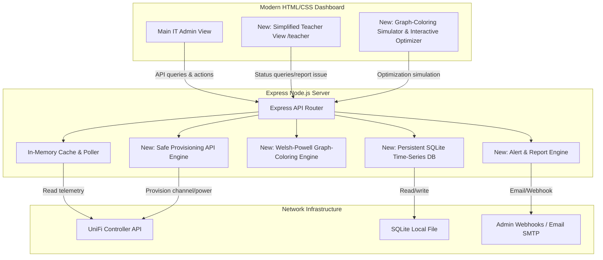

# 💡 Strategic Roadmap: 10 Advanced Features for UniFi Network Health Analyzer

This roadmap captures the next major capabilities to evolve the dashboard from diagnostics into a proactive remediation suite for school environments.

---

## 🏗️ Architectural Overview of Extensions

---

## 📋 10 Feature Blueprints

1. **Proactive Webhook Alerts & Scheduled PDF Digests**  
   Trigger threshold-based alerts and periodic PDF reports via SMTP/webhooks.

2. **AP Sticky-Client Roaming Diagnostics**  
   Detect clients with weak RSSI on distant APs and recommend roaming/radio policy fixes.

3. **Virtual Classroom Grouping & Wi-Fi SLAs**  
   Group APs by classroom and calculate a simple readiness SLA (green/yellow/red).

4. **Graph-Coloring Channel Optimization Engine**  
   Add Welsh-Powell channel allocation to compute conflict-minimized plans.

5. **Safe Write-Back Controller Integration**  
   Add guarded write-back actions (kick client / update AP radio) behind `WRITEBACK_PASSCODE`.

6. **Airtime Fairness & Multi-SSID Traffic Auditor**  
   Surface SSID airtime hogs and identify low-throughput/high-airtime clients.

7. **DHCP Pool & IP Lease Exhaustion Predictor**  
   Track subnet lease utilization and warn before address exhaustion.

8. **SQLite Time-Series with Historic Time-Travel**  
   Persist snapshots to SQLite and enable date-range trend analysis beyond process restarts.

9. **Rogue AP & Mobile Hotspot Spectrum Radar**  
   Parse UniFi rogue AP telemetry and estimate likely physical proximity.

10. **Teacher Portal & Live Feedback Logger**  
   Add `/teacher` read-only status and `/api/teacher/report` incident logging.

---

## 🚀 Recommended Implementation Sequence

1. **Phase 1 (Persistence):** SQLite storage + historical chart enhancements  
2. **Phase 2 (Operations):** alerts/reporting + simplified teacher portal  
3. **Phase 3 (Advanced Optimization):** graph-coloring engine + safe write-back actions
